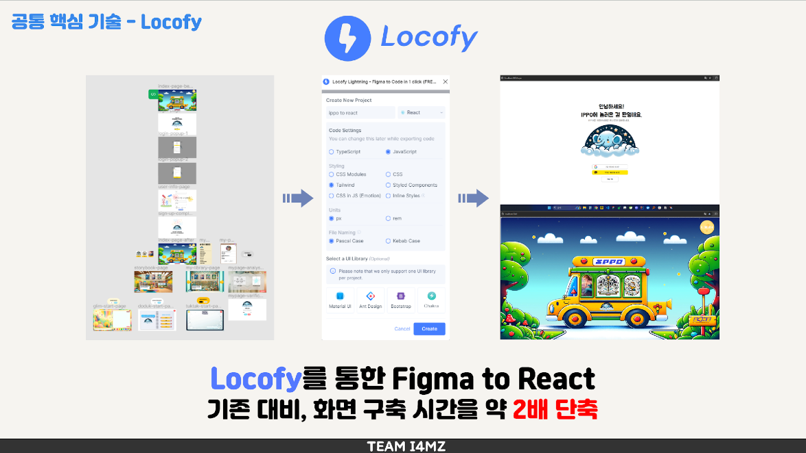
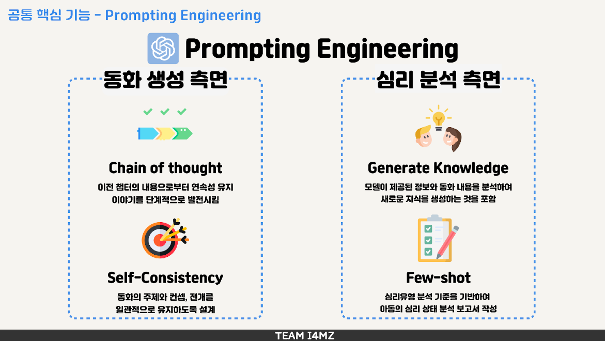

# 🎁ippo

## 프로젝트 개요

> 프로젝트 IPPO(아 이뽀, 아 이쁘다!)는 다양한 AI 모델을 활용하여 아동을 위한 인터렉티브 미디어 컨텐츠를 제작하는 것을 목표하였습니다.  
> '디지털 베이비' 라는 단어가 생겨나고 있는 현 시대, 단순히 미디어 컨텐츠를 볼 뿐인 수동적 감상자에서,  
> 직접 미디어 컨텐츠에 나의 생각을 관여하고 '나의 이야기'를 만들어가는 능동적 참여자로서 아동의 인지 정서 발달을 함양을 지향합니다.

## 기획 의도

> '코로나 키즈' 라는 단어를 알고 계신가요?  
> 코로나 키즈란 코로나 팬데믹 시기에 태어난 현재 만 0~5세 아동입니다. 
> 코로나 이후 아동은 행동 제한, 고립감 등을 느끼며 인지적 발달 지연 사례가 상승하였고, 
> 동시에 하루 평균 미디어 시간 이용이 증가함에 따라 아동을 타겟층으로 한 디지털 콘텐츠의 수요가 상승하였습니다. 
> 그렇기에 저희는 인터렉티브 시장을 겨냥하여 아동을 보고, 듣고, 말하고 움직이게 만드는 동화 컨텐츠를 기획하게 되었습니다. 

# 🧸기능 소개

## 공통기능

공동 작업 핵심 기술 소개

> Figma에서 디자인된 사용자 인터페이스를 React 기반의 웹 애플리케이션으로 효율적으로 전환하기 위해 Locofy 플러그인을 활용하여 Figma 디자인을 React 코드로 변환하는 자동화된 워크플로우를 구현

> prompring engineering
>
> - 이전 챕터의 내용으로부터 연속성을 유지함으로써 스토리 전개가 이어지도록 구현
> - 모델이 제공된 정보와 동화 내용을 분석하여 새로운 지식을 생성
> - 심리 유형 분석 기준을 기반하여 만들어진 동화 데이터를 기반으로 심리 분석 보고서 작성

## 그림동화
그림동화 서비스 소개

> 멀티모달 인터페이스(음성, 텍스트, 그림)을 활용해서 나만의 동화를 창작해볼 수 있습니다.

> 원하는 동화가 생성되었다면 실제 동화책을 볼 수 있어요.

> 동화 내용 기반 심리 분석을 위한 질문지가 생성이 됩니다. 질문에 답을 하면 애착유형 분석하게 됩니다. 마이페이지의 분석표에서 확인할 수 있습니다.

핵심기술

> 웹소켓 기반 비동기 스트리밍으로 동화 내용을 실시간을 확인할 수 있습니다. 이를 통해서 사용자의 대기 시간을 줄여 흥미도를 높일 수 있습니다.

> OpenAI STT 모델, Whisper를 활용하여 음성 인터페이스를 활용하였습니다. 아이들이 언어를 통해서 자신만의 동화를 창작할 수 있도록 사용자 편의성을 개선하였습니다.

## 교훈동화

1. Midjourney API Blending
   
   
   > 이미지 생성 AI인 Midjourney API를 활용하여, 동화 내용에 맞게 일러스트 삽화를 생성 후 아이의 얼굴과 합성하는 내부 로직을 구현하였습니다.
   > 최종적으로 나의 동화책에 내 얼굴이 주인공으로 나오는, 아이가 동화의 주체로서의 몰입감을 선사하는 인터렉티브한 포맷을 제공하였습니다.
2. 아아
   > 저쩌고

## 뚝딱동화

# ✨프로젝트 상세

### 팀원 정보

| 이름 | 직책 | 담당 |
| ---- | ---- | ---- |
| 김이삭 | 팀장 | 프로젝트 일정 관리, 백로그 관리, 그림동화 콘텐츠 기술 |
| 박리나 | 팀원 | 개발 환경 및 프로젝트 기술 스택 버전 관리, 팀장 대리, 그림동화 콘텐츠 기술 |
| 정혜연 | 팀원 | 형상 관리, 프로젝트 회의 서기, 교훈동화 콘텐츠 기술 |
| 신우철 | 팀원 | 컨벤션 룰 관리, 교훈동화 콘텐츠 기술 |
| 김동호 | 팀원 | 뚝딱동화 콘텐츠 기술 |
| 최지성 | 팀원 | 데일리 스크럼 체커, 뚝딱동화 콘텐츠 기술 |

### 개발 환경 및 프로젝트 기술 스택

🖼️ FrontEnd
|기술|버전|
|-----|----|
|Node|20.10.0|
|React|18.2.0|
|Tailwind|3.2.7|

🛢️ BackEnd
|기술|버전|
|------|---|
|Springboot|3.1.5|
|Gradle|7.6.1|
|Java|17.0.2|
|JPA|latest|
|Express|4.18.2|

📡 DevOps
|기술|버전|
|------|---|
|nginx|stable|
|Docker|lastest|

🪅 AI Model
|기술|버전|
|------|---|
|Langchain|0.1.0|
|openai|1.6.1|
|google-api-core|2.15.0|
|gpt4|gpt-4-1106-preview|
|dall-e|dall-e-3|
|whisper|whisper-1|

### API 명세서

### ERD

### 와이어프레임 & 프로토타이핑

- **Figma로 Wireframe 및 화면 설계 구현**
  

### 시스템 아키텍처

# 🎞️그라운드 룰 & 활동 기록

그라운드 룰

  - 존중해주기 
  - 불만이 있을경우 정중하게 대화하기 
  - 피치 못할 사정이 있어 결석, 부재 시 연락하기 
  - 질문하는데 어려움 느끼지 말기 
  - 지각하지 않기 (하게 되면 팀원들한테 알리기) 
  - 프로젝트 회의에 적극적으로 임하기 
  - 회의 진행 시 자신의 생각을 잘 정리해서 말하기 

### WBS

### 개발 컨벤션
